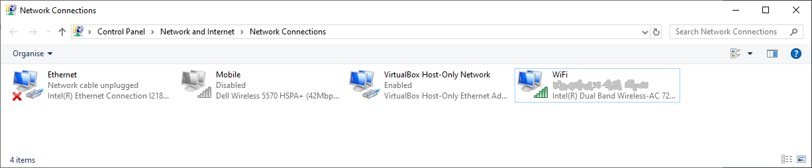

Windows connection sharing
==========================

We will be _sharing_ the WiFi connection and _connecting_ Raspberry Pi through Ethernet cable. Open Control Panel &rarr; Network And Sharing Centre &rarr; Change Adapter Settings (or Network Connections).

Select WiFi, right-click for Properties and select "Allow other network users to connect through this computer's internet connection". Choose "Ethernet" as Home networking nonnection.

Connect Raspberry Pi with Ethernect cable and boot it. The DHCP client is already enabled and will configure the IP address. The address will be printed on the RPi console.

Finding Raspberry Pi address
----------------------------

If you run the Rapberry Pi headless, this is what you can do to find it's IP address:

Use `ipconfig` to find your "Ethernet" adapter IP address:

    Ethernet adapter Ethernet:
    IPv4 Address. . . . . . . . . . . : 192.168.137.1

Use `arp -a` to list cached IP addresses. If you know your Pi's MAC address (`b8-27-eb-ea-86-de` in this case), you know it's IP address.

    Interface: 192.168.137.1 --- 0x12
      Internet Address      Physical Address      Type
      192.168.137.248       b8-27-eb-ea-86-de     static

These commands work because Pi runs `avahi` zeroconf daemon for host name discovery:

    ping -4 raspberrypi
    ssh pi@raspberrypi
